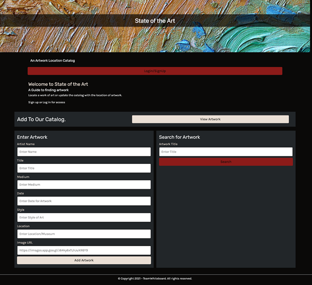

ArtFiles2: Contributors 
•	Hunter Johnson
•	Jennifer Lindsey
•	Alex Elliott
•	Cody Concklin 

User Story: As a museum curator, I want to be able to view works of art to see where they are displayed. As a member of the site, I can add new artwork to my museum’s collection. 

Technologies Used: 
•	Node.js
•	Handlebars.js
•	MySQL
•	Sequelize ORM
•	Express.js 

Deployment Requirements: 
•	Live URL via Heroku
•	GitHub URL:  https://trayehunter1.github.io/ArtFiles2/

Mock Up: 

